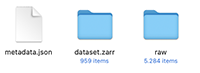
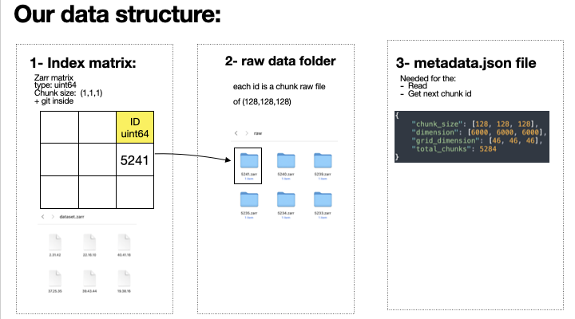

# Versioned Multi dimension storage

### Features:
- Multiple branches
- Multiple collaborators
- Can jump anytime to any historical point
- Data is not replicated and no extra reading writing cost.

### Data structure:

Every change is a now commit:

### How to:
#### Create data:
`$ data = VersionedZarrData(root_path=PATH, dimension=DIMS, chunk_size=CHUNK_SIZE)`

`$ data.create(overwrite=True)`
#### Open data:
`data = open_versioned_data(PATH)`

#### Commit now modification:
`$ data.write_block(data=dummy_data, grid_position=grid_position)`

#### Checkout branch:
`$ data.git.checkout_branch(branch_name=BRANCH_NAME, create=True)`

#### Checkout history commit:
`$ data.git.checkout_branch(COMMIT_ID)`

Currently, benchmarking different scenarios.

