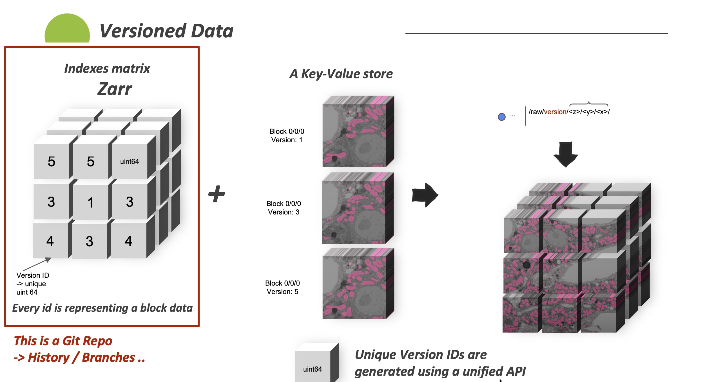
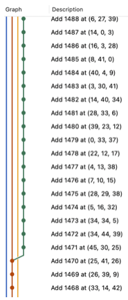

### Versioned Storage Python SDK 
| [JAVA SDK IS HERE](https://github.com/JaneliaSciComp/VersionedN5)

----
#### Proposed solution:
To enable block-based data versioning for nd data, a mix is created of:
- Version block index using [Zarr](https://zarr.readthedocs.io/en/stable/) + [Git](https://git-scm.com/)
- A key value store: using [N5](https://github.com/saalfeldlab/n5) for now

### Features:
- Multiple branches
- Multiple collaborators
- Can jump anytime to any historical point
- Data is not replicated and no extra reading writing cost

Every change is a now commit:

