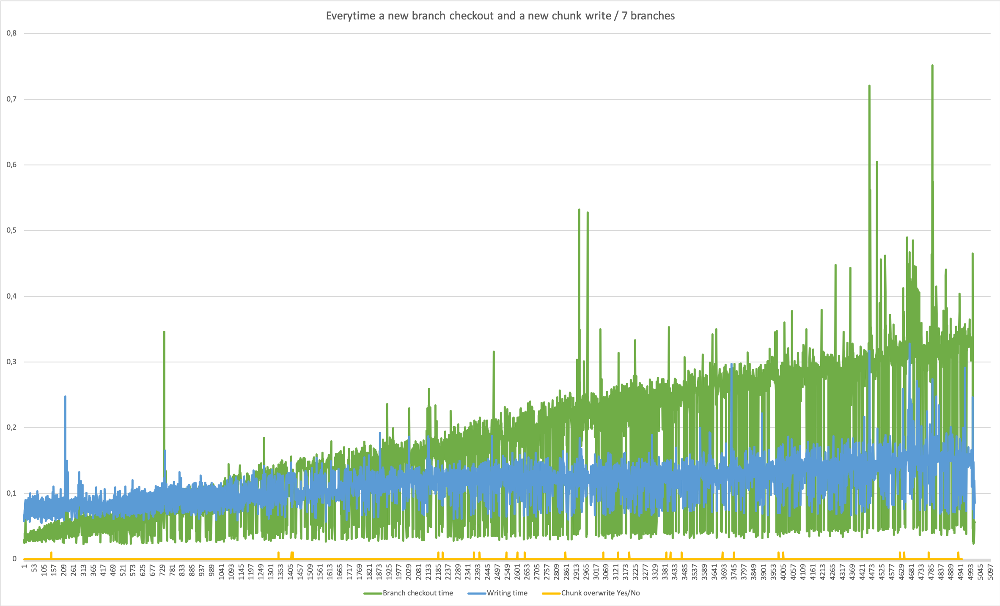

## Goal : Versioned storage

# Graphs:

TODO:
Create graph of tiledb memory
move to leveldb
Git diff tool to undrestand binary id
test git gc with chunk size 1,1,1 and chunk size whole image and record the storage size
