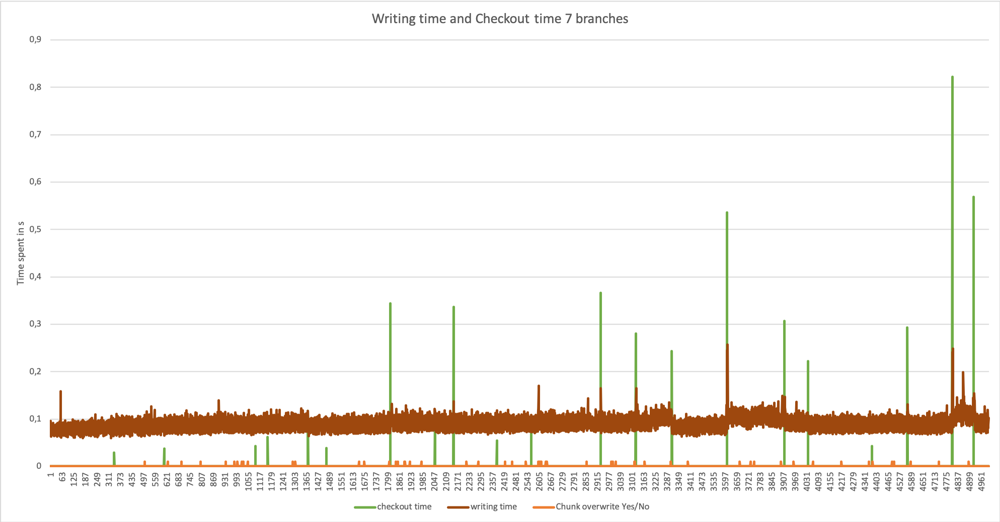
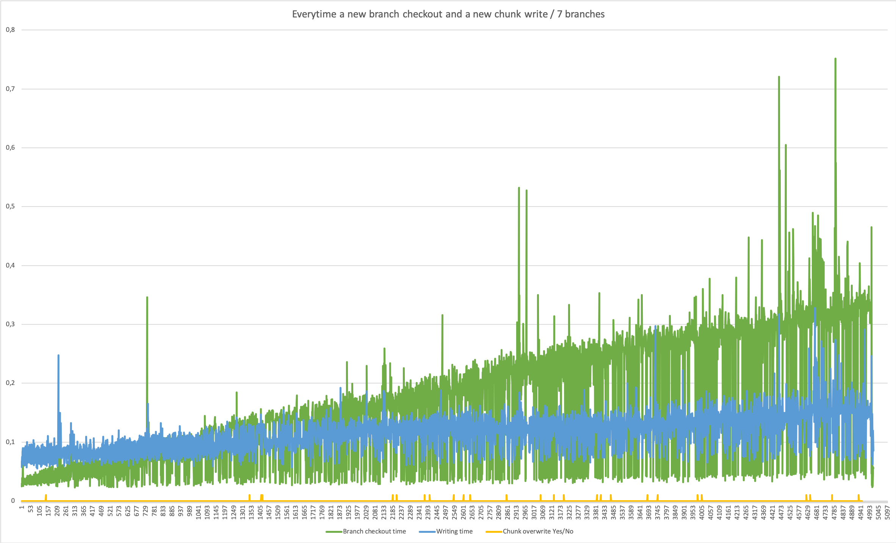

# Graphs:
Testing writing and checkout time progression.
#### Case 1: checkout every ~50..100 iteration

#### Case 2: Extreme case checkout a new branch everytime writing a new chunk

## Garbage collection test
Testing index chunk size (1,1,1) (MAX,MAX,MAX)

#### Checkout time: 

### Writing time:

#### Both cases:

#### File size progression:
How file size progress per time in both cases

